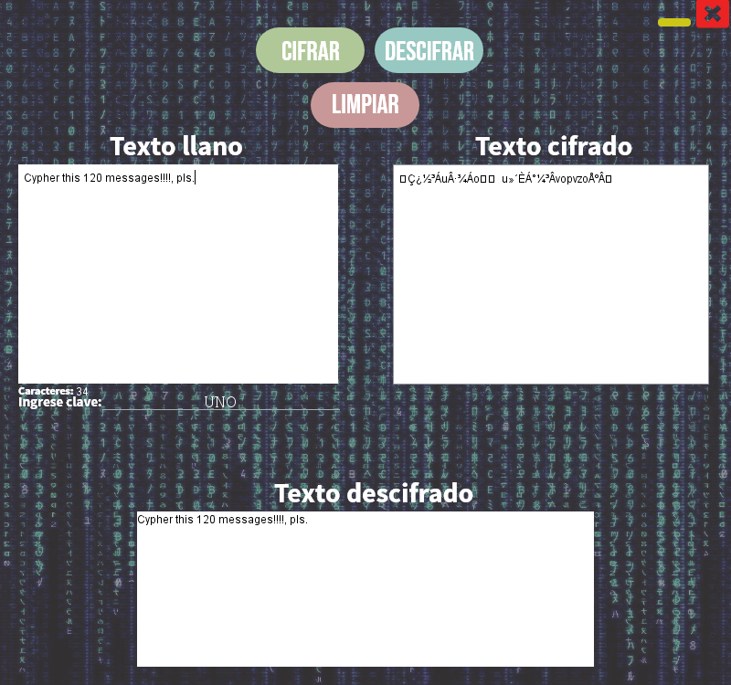
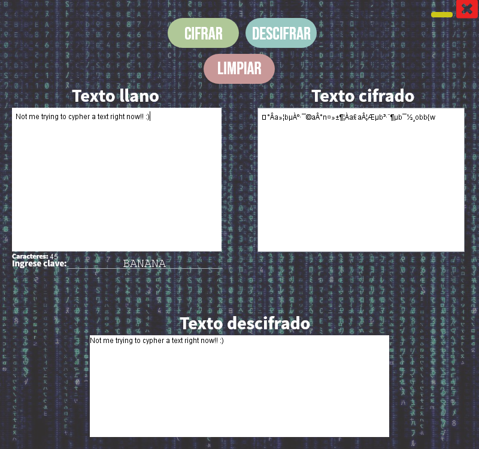

# Vigenere-Cipher

This is my implementation of the Vigenere Cypher in Java for 256 characters in the Ascii Table for my Networks Security and Intercommunication class.

### DISCLAIMER ###
The UI was designed based on teacher's requirements, that's why it may not that impressive

